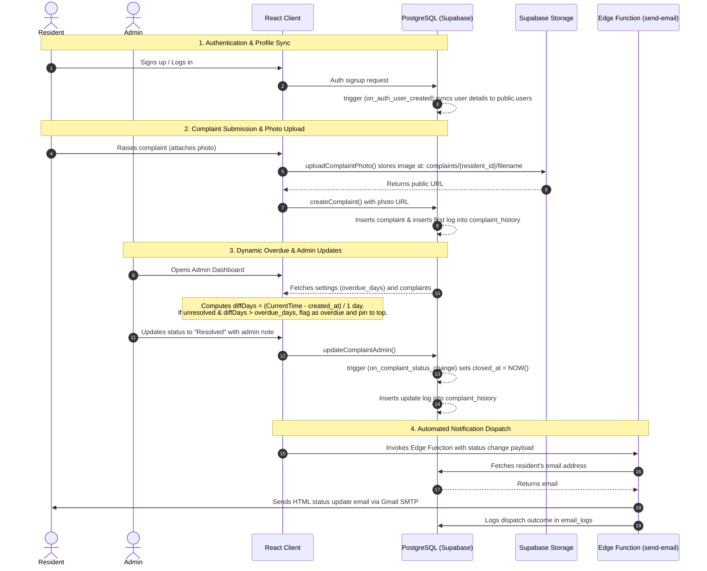

# System Design & Workflow: Society Maintenance Tracker

This document details the complete system workflow, database design, and key architectural choices.

---

## 1. Complete Project Workflow

The diagram below illustrates how residents, admins, the Supabase database, storage buckets, and the email notification service interact.



---

## 2. Complaint History & Audit Model

To maintain a secure audit trail, all actions are logged in the `complaint_history` table:
* **Creation Log**: An initial log is automatically saved when a complaint is registered (status `Open`).
* **Resident Edits**: Any category or description updates made by residents (only permitted while status is `Open`) write an edit history entry.
* **Admin Updates**: Changes to priority or status require an admin note, which is logged to the history timeline.
* **Closed Timestamp Trigger**: A database trigger `on_complaint_status_change` runs before updates. It automatically sets `closed_at = NOW()` if the status changes to `Resolved`, and resets it to `NULL` if a complaint is reopened.

---

## 3. Dynamic Overdue Detection

The system calculates SLA violations dynamically during runtime instead of storing stale states:
1. **Configuration**: Admins configure the threshold (`overdue_days`, defaults to 7) in the settings panel, saved in the `settings` table.
2. **Dynamic Calculation**: When complaints are fetched:
   * If `status === 'Resolved'`, it is not overdue.
   * Else, the age is calculated:
     ```text
     diffDays = ceil( (CurrentTime - created_at) / (1000 * 60 * 60 * 24) )
     ```
   * If `diffDays > overdue_days`, the ticket is marked as overdue (`is_overdue = true`).
3. **UX Display & Pinned Priority**: Overdue complaints are colored red and the frontend sorting algorithm overrides standard rules to pin unresolved, overdue tickets at the top of the queue.

---

## 4. Secure Photo Handling

* **Bucket Isolation**: Resident attachment files are uploaded to a public Supabase Storage bucket named `complaints`.
* **Path Pattern**: Files are isolated by resident IDs using the path structure `complaints/{resident_id}/{unique_file_name}.{ext}`.
* **Database Link**: The storage API returns a public URL, which is saved in the `photo_url` column of the `complaints` table and rendered inside the complaint details cards.
* **Deletion**: Residents can choose to remove a photo during edits, setting `photo_url` to `NULL`.

---

## 5. Multi-Channel Notification Flow

1. **Supabase Edge Function (Primary)**: Triggered via the frontend using `supabase.functions.invoke()`. It runs server-side, reads Gmail credentials securely from Supabase secrets, dispatches HTML notifications using Nodemailer, and writes logs to `email_logs`.
2. **Database Trigger (Fallback)**: When a raw email entry is logged with status `Pending`, a PostgreSQL trigger `trigger_on_pending_email` invokes the `pg_net` database extension to make an asynchronous HTTP POST request to the Resend API using the api key stored in the `settings` table.
